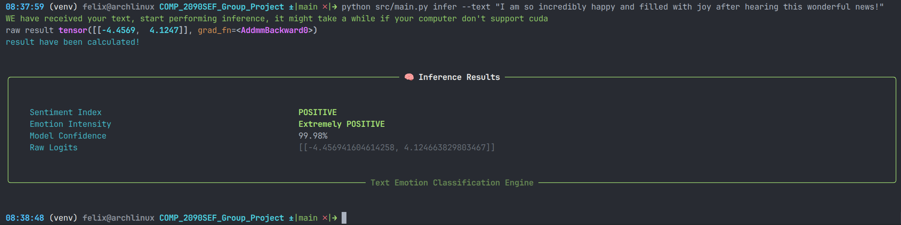
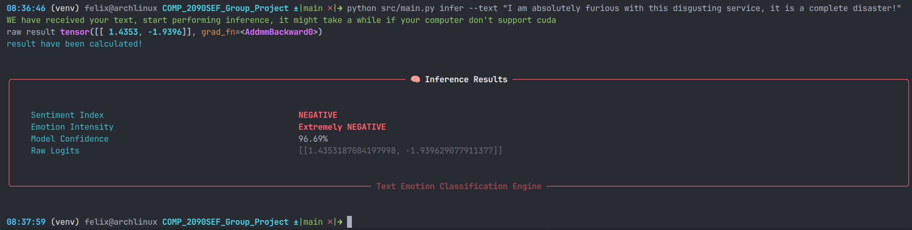

<h1 align="center">🧠🧠 Text Emotion Classification 🧠🧠</h1>

<p align="center">
  <strong>COMP2090SEF Group Project</strong><br>
  <em>Hong Kong Metropolitan University (HKMU)</em>
</p>

<p align="center">
  
</p>

<!-- Tiny Picture to decorate it -->
<p align="center">
  
  
  
</p>


---

## 📌 Project Overview
This application performs **Real-time Emotion Classification** on text input. Using a Deep Learning model built with **PyTorch** with dataset `b 50K Movie Reviews Dataset`(free to use in academic and non-commercial activity), the system can detect subtle emotional states **Positive** and **Negative** from user-provided sentences.

### ✨ Key Features
- **Real-time Inference:** Immediate emotion detection from raw text.
- **Persistent Storage:** Uses `shelve` for efficient persistent data handling.
- **Hardware Acceleration:** Full support for **CUDA** (NVIDIA GPUs) for faster processing.

---

## 👥 Meet the Developers
<div align="center">


| Name | Student ID |
| :--- | :--- |
| **Gong ZheKai** | `14131594` |
| **Yim Yan Kin** | `14256540` |
| **Yu Ho Yip Tommy** | `14250640` |
</div>

---

## 🏗️ Filesystem Architecture Overview
```
(venv) felix@archlinux COMP_2090SEF_Group_Project ±|main✔|→ tree -I venv
.
├── data
│   ├── model
│   ├── model_with_loss_40.609799617595854.model
│   ├── model_with_loss_57.27369132937747.model
│   └── vocab_db
├── LICENSE
├── markdown_resource             # Folder used to store markdown images
├── README.md                     # README markdown file
├── requirements.txt              # Python dependencies list
├── src     
│   ├── core      
│   │   ├── inference.py          # Class Inference defined here to do emotion classification
│   │   ├── network.py            # Class TextEmotionClassificationNetwork defined here to describe the neural network structure
│   │   ├── text_preprocess.py    # Separate functions defined here to preprocess user input text or file 
│   │   ├── training.py           # Train function defined here to training the model
│   │   ├── utils.py              # Some useful shared(within core) functions defined here
│   │   └── vocabulary.py         # Class Vocabulary defined here response to serialization words
│   └── main.py                   # The entry of entire program
└── training_dataset              # raw training dataset folder
    └── processed.csv             # Provided by `IMDb 50K Movie Reviews Dataset`
```
---

## 🚀 Installation & Usage

### 1. Prerequisites
- **Python 3.10+** (Required)
- **Git** (For cloning)
- **NVIDIA GPU** (Optional, for CUDA acceleration)

### 2. Setup (Windows/macOS/Linux)
```bash
# Clone the repository
git https://github.com/gzk6332987/COMP_2090SEF_Group_Project.git
cd COMP_2090SEF_Group_Project

# Create and activate virtual environment
# Windows:
python -m venv venv
.\venv\Scripts\activate

# macOS/Linux:
python3 -m venv venv
source venv/bin/activate

# Install dependencies (It might take a while, please wait in patience)
pip install -r requirements.txt
```


# 🚀 Usage Tutorial (CLI Commands)

This application use well decorate Command Line Interface (CLI) powered by **Typer** and **Rich** (two python lib). **Attention, execute all commands from the project root**.

### 🧰 Hardware & System Check
Verify if your system supports **NVIDIA GPU acceleration (CUDA)** for faster training and inference, if your computer do not have NVIDIA GPU, please ignore this section, if your computer have NVIDIA GPU but do not support CUDA, we recommend you search online and find out what to do to enable CUDA.

```bash
python src/main.py cudatest
```

### ❓ Build in help with `--help`

`your_commands --help` is a useful tool to learn how to use a command, you can get detailed description and argument notation from here.


### 🚀 Emotion Inference (Real-time Prediction)

Classify emotions by providing a string directly or reading from a text file. **Note: Only English text is supported.**

- Detect From Direct Text: `python src/main.py infer --text "I am feeling absolutely wonderful today!"`
- Detect From Text File: `python src/main.py infer --file "./my_story.txt"`

**Positive example**



**Negative example**



### 🥊 Training Model

Please running `python src/main.py train --help` to see more details about training model yourself!

**example**

