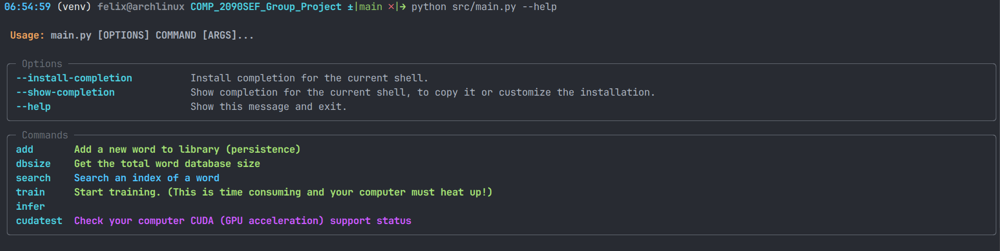
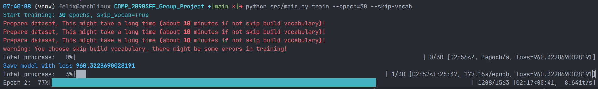

<h1 align="center">🧠 Text Emotion Classification App (PyTorch)</h1>

<p align="center">
  <strong>COMP2090SEF Group Project</strong><br>
  <em>Hong Kong Metropolitan University (HKMU)</em>
</p>

<p align="center">
  
  
  
</p>


---

## 📌 Project Overview
This application performs **Real-time Emotion Classification** on text input. Using a Deep Learning model built with **PyTorch**, the system can detect subtle emotional states such as **Joy, Sadness, Anger, and Fear** from user-provided sentences.

### ✨ Key Features
- **Real-time Inference:** Immediate emotion detection from raw text.
- **Persistent Storage:** Uses `shelve` for efficient data handling.
- **Hardware Acceleration:** Full support for **CUDA** (NVIDIA GPUs) for faster processing.

---

## 👥 Meet the Developers
<div align="center">


| Name | Student ID |
| :--- | :--- |
| **Gong ZheKai** | `14131594` |
| **Yim Yan Kin** | `14256540` |
| **Yu Ho Yip Tommy** | `14250640` |
</div>

---

## 🏗️ System Architecture & OOP Design
<!-- To satisfy course requirements, this project strictly adheres to **Object-Oriented Programming (OOP)** principles:

- **Encapsulation (`data_processor.py`):** The `TextPreprocessor` class manages internal state for cleaning and hashing logic, exposing only necessary methods.
- **Inheritance (`model.py`):** Our `EmotionClassifier` extends `torch.nn.Module`, leveraging PyTorch’s robust neural network framework.
- **Abstraction (`app_engine.py`):** High-level API that allows users to perform classification without managing tensors or weight matrices.
- **Modularity:** The codebase is decoupled into 3+ distinct modules for scalability. -->
```
.
├── data/                  # Persistent storage (Models & Vocab DB)
├── src/
│   ├── main.py            # Application Entry Point
│   └── core/              # Logic Layer (The "Brain")
│       ├── network.py     # Neural Network Definitions
│       ├── vocabulary.py  # Word Mapping Logic
│       └── inference.py   # Prediction Logic
└── training_dataset/      # Source CSV data
```
---

## 🚀 Installation & Usage

### 1. Prerequisites
- **Python 3.10+** (Required)
- **Git** (For cloning)
- **NVIDIA GPU** (Optional, for CUDA acceleration)

### 2. Setup (Windows/macOS/Linux)
```bash
# Clone the repository
git clone https://github.com
cd COMP_2090SEF_Group_Project

# Create and activate virtual environment
# Windows:
python -m venv venv
.\venv\Scripts\activate

# macOS/Linux:
python3 -m venv venv
source venv/bin/activate

# Install dependencies
pip install -r requirements.txt
```


# 🚀 Usage Tutorial (CLI Commands)

This application features a professional Command Line Interface (CLI) powered by **Typer** and **Rich**. Execute all commands from the project root.

### 🧰 Hardware & System Check
Verify if your system supports **NVIDIA GPU acceleration (CUDA)** for faster training and inference:
```bash
python src/main.py cudatest
```

### ❓ Build in help with `--help`




### 🚀 Emotion Inference (Real-time Prediction)

Classify emotions by providing a string directly or reading from a text file. **Note: Only English text is supported.**

- Via Direct Text: `python src/main.py infer --text "I am feeling absolutely wonderful today!"`
- Via Text File: `python src/main.py infer --file "./my_story.txt"`


### 🥊 Training Model

Please running `python src/main.py train --help` to see more details about training model yourself!

**example**

